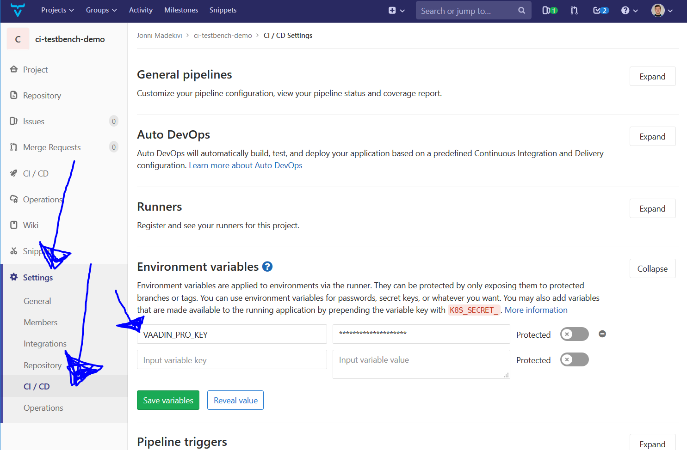

# Vaadin Flow template project that runs TestBench test in GitLab CI

# Building the project
`mvn install` - will run unit tests, but no TestBench tests.

## To run TestBench tests locally on development machine
Run `mvn --activate-profiles=local-it verify`.

## How CI runs tests:
CI runs command line `mvn --activate-profiles=gitlab-it $MAVEN_CLI_OPTS verify`.

# How it all works

## pom.xml

When `local-it` or `gitlab-it` is activated, `jetty-maven-plugin` is configured to start jetty in Maven's `pre-integration-test` phase and stop it in `post-integration-test`.

`maven-failsafe-plugin` will run any `@Test` annotated methods from classes matching to patterns: `**/IT*.java`, `**/*IT.java` and `**/*ITCase.java`.

## Test code

`org.vaadin.jonni.testbench.MyIT` extends TestBench's `ParallelTest` which looks up from Java system property `com.vaadin.testbench.Parameters.hubHostname` where it can find a remotely conrollable web browser.

## .gitllab-ci.yml

Defines environment variables, Docker images and commands for Docker based build pipelines. See `.gitllab-ci.yml` and [GitLab documentation](https://docs.gitlab.com/ee/ci/yaml/) for more info.

# Appendix

When modifying the .gitlab-ci.yml it can be extremyly useful to [debug the GitLab CI builds locally](http://campfirecode.io/debugging-gitlab-ci-pipelines/).